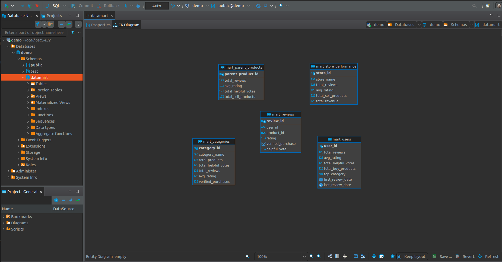

# AMAZON REVIEWS PROCESSING APPLICATION DEPLOYED ON GOOGLE KUBERNETES ENGINE (GKE)
## Introduction
This project implements a robust, cloud-native data processing pipeline for the [**Amazon Reviews dataset**](https://amazon-reviews-2023.github.io/), leveraging both streaming and batch paradigms. Deployed on a **Google Kubernetes Engine (GKE)** cluster, the system is provisioned and automated using **Terraform** and **Ansible** for infrastructure setup, with **Jenkins** handling CI/CD pipelines. The data—comprising user reviews and item metadata—enters the system through two main channels:
* **Stream processing**: The stream processing pipeline is built to capture real-time changes using **Apache Flink** and **Apache Kafka**. Data changes from the PostgreSQL database are captured through **Kafka Connect** using the **Debezium connector**, and published to Kafka topics (`review` and `metadata`) managed by the Strimzi Kafka Operator. For durability and optimized storage, these streams are also replicated from hot to cold storage (**Minio**) using the Kafka **S3 Sink Connector**. Flink jobs, managed by the **Flink Kubernetes Operator**, consume these streams, apply schema validation via the **Schema Registry**, and perform transformations like data cleaning and filtering. The system then joins the `review` and `metadata` streams on the `parent_asin` field to produce a merged output stream, which is written to the `merged_reviews_metadata` Kafka topic for downstream consumption.
* **Batch processing**: The batch processing pipeline handles historical and large-volume raw JSON files. These files are ingested manually into the bronze layer of the data lake (**Minio**) and processed using **Apache Spark**, which is managed by **Spark Kubernetes Operator**. **Additionally, Spark jobs will get the schemas which are inserted by the stream pipeline from the Schema Registry for schema compatibility**. Five Spark jobs are involved in the batch workflow and orchestrated by **Apache Airflow**:
  1. **Raw2delta-avro:** Converts raw JSON into Delta Lake format and enforces schema validation using the Schema Registry.
  2. **Merge-processing:** Enriches data by merging reviews and metadata, similar to the streaming pipeline.
  3. **Adding-uuidv7:** Adds a unique `review_id` (UUIDv7) to each review from historical data as a primary key.
  4. **Handle-streaming-data:** Consumes the `merged_reviews_metadata` Kafka topic in micro-batches, decodes byte streams, adds UUIDv7, and stores clean data in Minio alongside historical records.
  5. **Generate-silver-schema:** Merges clean batch and stream data, applies SQL transformations, builds a snowflake schema format, which is then stored in PostgreSQL for querying.
  6. **Generate-data-mart:** Merges clean batch and stream data, applies SQL transformations, and builds the data marts in the gold layer, which is then stored in PostgreSQL, ready for analytics and reporting.

Additionally, external access can be routed by **Nginx-ingress**. The architecture also includes a **Hive Metastore** and **Trino** for parallel querying parquet files (Delta Lake format) directly from Minio. For monitoring and observability, **Prometheus**, managed by the **Prometheus Operator**, collects metrics from Kafka, Flink, and Spark processors. These are visualized in **Grafana**, with real-time alerts pushed to **Slack** in case of anomalies, ensuring operational reliability and transparency across the pipeline.

## Architecture overview


## Spark Operator architecture
The image below is the detailed illustration about how Spark Operator handles Spark Jobs and manages kubernetes resources. More details can be found [here](https://www.kubeflow.org/docs/components/spark-operator/overview/).


## 🚀 Storage, Infrastructure & Automation
- **Provisioning:** Terraform & Ansible  
- **CI/CD:** Jenkins  
- **Platform:** Kubernetes (GKE)
- **Storage:** Minio, the backbone of system, where stores all data (bronze, silver, gold) and Flink savepoints, which is mounted to external cloud storage **Google Filestore**.

## 🔄 Stream Processing Pipeline
### Key Components:
- **Change Capture:** Kafka Connect with **Debezium Connector**
- **Streaming Backbone:** Apache Kafka (Strimzi Kafka Operator)
- **Schema Validation:** Schema Registry (Avro)
- **Storage Replication:** Kafka **S3 Sink Connector** (to Minio)
- **Processing Engine:** Apache Flink (Flink Kubernetes Operator). Flink savepoints are also saved into Minio, therefore Flink can restart without loss or duplication in cases Flink jobs failed.

## 🗃️ Batch Processing Pipeline
- **Storage:** Minio (object store / data lake)
- **Processing Engine:** Apache Spark (Spark Kubernetes Operator)
- **Schema Management:** Schema Registry (Avro)

## 📊 Query & Analytics

- **Metastore:** Hive Metastore  
- **Query Engine:** Trino (SQL access to Delta Lake on Minio)  
- **Data Marts:** PostgreSQL

## 📈 Monitoring & Observability

- **Metrics Collection:** Prometheus (Prometheus Operator)  
- **Visualization:** Grafana Dashboards  
- **Alerting:** Slack notifications for anomalies

## Deploy application to GKE cluster
### Set up infrastructure using Terraform
You can follow the instructions (install gcloud CLI, create GKE cluster, enable Filestore CSI driver) from [this repository](https://github.com/longphamkhac/IQA)

- If you encounter the `terraform oauth2` error, please fix by this command:
```shell
gcloud auth application-default login --scopes=https://www.googleapis.com/auth/cloud-platform
```
## Installation
### Follow these steps to set up the stream processing environment.

### 1. Create Kubernetes Namespaces
- Create namespaces for infrastructure, processor, and airflow.

```shell
kubectl create namespace infrastructure &&
kubectl create namespace processor &&
kubectl create namespace airflow
```

### 2. Install Postgres and MinIO Credentials
- Create Kubernetes secrets for Postgres and MinIO credentials in the specified namespaces.

```shell
kubectl create secret generic postgres-credentials \
  --from-file=config/postgres/postgres-credentials.properties \
  -n infrastructure &&

kubectl create secret generic minio-credentials \
  --from-file=access-key=config/s3/access-key.properties \
  --from-file=secret-key=config/s3/secret-key.properties \
  -n infrastructure &&

kubectl create secret generic minio-credentials \
  --from-file=access-key=config/s3/access-key.properties \
  --from-file=secret-key=config/s3/secret-key.properties \
  -n processor
```

### 3. Install Storage (Postgres and MinIO)
- Deploy Postgres and MinIO using the Helm chart in the `infrastructure` namespace.

```shell
helm upgrade --install storage helm/storage -n infrastructure
```

### 4. Create MinIO Buckets
- Execute Minio pod in the `infrastructure` namespace (**Modify the Minio pod name**).
```shell
kubectl exec -it minio-54776d6f4d-qkdpp -n infrastructure -- bash
```
- Set up the MinIO alias and create buckets for Flink and Kafka tiered storage.
```shell
mc alias set minio http://minio-svc:9000 minio_access_key minio_secret_key
mc mb minio/flink-data &
mc mb minio/kafka-tiered-storage
```

### 5. Install Strimzi Kafka Operator
- Install Strimzi Kafka Operator in the `operators` namespace by following commands.
```shell
curl -sL https://github.com/operator-framework/operator-lifecycle-manager/releases/download/v0.20.0/install.sh | bash -s v0.20.0
curl -sL https://operatorhub.io/install/strimzi-kafka-operator.yaml -o helm/strimzi_kafka_operator/strimzi-kafka-operator.yaml
kubectl apply -f helm/strimzi_kafka_operator/strimzi-kafka-operator.yaml
```
- Verify whether Strimzi Kafka Operator deployed successfully.
```shell
kubectl get pod -n operators
```


### 6. Install Kafka related infrastructure (Kafka, KafkaConnect, Provectus and Schema Registry)
- Deploy Kafka-dependent infrastructure **(Kafka Connect, Provectus and Schema Registry)**.
```shell
helm upgrade --install kafka helm/strimzi_kafka_operator -n infrastructure
```
- You can verify all the pods in the `infrastructure` namespace by this command.
```shell
kubectl get pods -n infrastructure
```


### 7. Install Connectors
- Build and push docker image for connectors.
```shell
docker build -t longpk1/connectors kafkaconnect/.
docker push longpk1/connectors
```
- Install KafkaConnectors (Debezium and S3 Sink Connector).
```shell
helm upgrade --install kafkaconnector helm/kafkaconnector -n infrastructure
```
- You can verify all the connectors in the `infrastructure` namespace by this command:
```shell
kubectl get kafkaconnector -n infrastructure
```


### 8. Install Flink Operator
- Deploy Flink Operator using the Helm chart in the `processor` namespace.
```shell
helm repo add flink-operator-repo https://downloads.apache.org/flink/flink-kubernetes-operator-1.10.0/
kubectl create -f https://github.com/jetstack/cert-manager/releases/download/v1.8.2/cert-manager.yaml
helm install -f helm/flink_operator/helm-values.yaml -n processor flink-kubernetes-operator flink-operator-repo/flink-kubernetes-operator
```
- Download raw JSON files from [Amazon Reviews streaming dataset](https://drive.google.com/drive/folders/1-QI2k0g2MgRGIHDSMPlURCIFtyz_QZuR?usp=drive_link) and put them into `stream_processing/jobs/data/processed` directory.
- Build and push docker image for reviews and metadata insertion job.
```shell
cd streaming/jobs
docker build -t longpk1/insert_reviews -f reviews/Dockerfile .
docker push longpk1/insert_reviews
docker build -t longpk1/insert_metadata -f metadata/Dockerfile .
docker push longpk1/insert_metadata
```
- Build and push docker image for merging streams job.
```shell
docker build -t longpk1/flink_merge_streams:1.0.4 stream_processing/merge/.
docker push longpk1/flink_merge_streams:1.0.4
```

### Follow these steps to set up the batch processing environment.

### 1. Download raw data
- Download raw JSON files from [Amazon Reviews dataset](https://amazon-reviews-2023.github.io/), put **reviews** JSON files to `batch_processing/data/reviews` and **metadata** JSON files for `batch_processing/data/metadata` directory.

### 2. Insert raw JSON files to bronze layer
```shell
kubectl port-forward svc/minio-svc 9000:9000 -n infrastructure
cd batch_processing && python upload_s3.py
```

### 3. Download JAR files
- Download JAR files from [here](https://drive.google.com/file/d/11Wfdw0NSQMK4q8Pkq0auxIM4wNOB6niZ/view?usp=drive_link) and them to `batch_processing/jars` directory.

### 4. Build and push docker image for spark processing
```shell
cd batch_processing
docker build -t longpk1/spark_processing:1.1.2 .
docker push longpk1/spark_processing:1.1.2
```

### 5. Install Spark Operator
```shell
helm repo add spark-operator https://kubeflow.github.io/spark-operator
helm install spark-operator spark-operator/spark-operator --namespace processor --version 1.2.7 --set serviceAccounts.spark.create=true --set serviceAccounts.spark.name=spark-operator-controller --set sparkJobNamespace=processor --set logLevel=4 --create-namespace
```

### Follow these steps to set up the Airflow orchestration

### 1. Build and push docker image for Airflow pipeline
```shell
docker build -t longpk1/airflow_pipeline:1.0.5 k8s/airflow/
docker push longpk1/airflow_pipeline:1.0.5
```

### 2. Deploy Airflow orchestration
```shell
helm install airflow apache-airflow/airflow --namespace airflow --create-namespace -f helm/airflow/custom-values.yaml
```
Verify Airflow pods:
```shell
kubectl get pod -n airflow
```

### 3. Deploy Nginx-Ingress
```shell
helm upgrade --install nginx-ingress helm/nginx-ingress -n infrastructure
helm upgrade --install ingress helm/ingress -n infrastructure
```
Modify the `/etc/hosts` file:
```shell
sudo nano /etc/hosts
```


### 4. Grant the permissions for default and airflow-worker service account to access SparkApplication, FlinkDeployment and Job resources
```shell
helm upgrade --install permission helm/permission -n airflow
```
Check permissions:
```shell
kubectl auth can-i get sparkapplications.sparkoperator.k8s.io -n processor --as=system:serviceaccount:airflow:default
kubectl auth can-i get sparkapplications.sparkoperator.k8s.io -n processor --as=system:serviceaccount:airflow:default
kubectl auth can-i get flinkdeployments -n processor --as=system:serviceaccount:airflow:airflow-worker
kubectl auth can-i create jobs -n processor --as=system:serviceaccount:airflow:airflow-worker
```

### 5. Create configmap for Spark jobs
```shell
kubectl create configmap spark-raw2delta-avro --from-file=k8s/spark/spark_application/raw2delta-avro.yaml -n airflow &&
kubectl create configmap spark-merge2delta --from-file=k8s/spark/spark_application/merge2delta.yaml -n airflow &&
kubectl create configmap spark-adding-uuidv7 --from-file=k8s/spark/spark_application/adding-uuidv7.yaml -n airflow &&
kubectl create configmap spark-generate-silver-schema --from-file=k8s/spark/spark_application/generate-silver-schema.yaml -n airflow &&
kubectl create configmap spark-generate-data-mart --from-file=k8s/spark/spark_application/generate-data-mart.yaml -n airflow &&
kubectl create configmap spark-streaming-data --from-file=k8s/spark/spark_application/streaming-data.yaml -n airflow
```

### 6. Create configmap for Flink jobs
```shell
kubectl create configmap insert-reviews --from-file=k8s/flink/jobs/insert-reviews.yaml -n airflow &&
kubectl create configmap insert-metadata --from-file=k8s/flink/jobs/insert-metadata.yaml -n airflow &&
kubectl create configmap flink-merge-streams --from-file=k8s/flink/flinkapplication/flink-merge-streams.yaml -n airflow
```

### 7. Create schema in PostgreSQL database
- Port forward `postgres-svc` service, create `test` and `datamart` schema in `dbeaver` manually.
```shell
kubectl port-forward svc/postgres-svc 5432:5432 -n infrastructure
```

### Start data processing pipeline
- Access Airflow UI `http://airflow.webserver.com`

- Access Kafka UI `http://kafka.ui.com`

- Start the stream pipeline on Airflow UI **(Must be started first to push the schema to Schema Registry for Spark jobs reference)**

- Start the batch pipeline on Airflow UI


After a while waiting for Spark jobs running, you can verify if they complete successfully:
```shell
kubectl get pod -n processor
```

```shell
kubectl get sparkapplication -n processor
```


### Verify snowflake schema in silver layer and data marts in gold layer
- The image below shows the silver snowflake schema diagram in data warehouse.

- The data marts in the gold layer are shown below.

- After generate data marts successfully, we can query in data warehouse for all tables. For example, we can query the `mart_store_performance` table and see that the store [NELEUS](https://www.amazon.com/stores/NELEUS/page/A0E160C9-23A6-49A7-9ED4-CC0C095BF717), a sportswear brand, has the highest revenue, which is nearly `2 million US dollars` !!!


### Install Hive Metastore and Trino for OLAP
```shell
helm upgrade --install olap  helm/olap/ -n processor
```


- Create schema using Trino
```shell
create schema if not exists lakehouse.amazonreviews
with (location = 's3://amazonreviews/');
```
- Create table using Trino
```shell
create table if not exists lakehouse.amazonreviews.merge_data (
	review_id VARCHAR,
	parent_product_id VARCHAR,
	user_id VARCHAR,
	time_id VARCHAR,
	product_id VARCHAR,
	rating DOUBLE,
	review_title VARCHAR,
	review_text VARCHAR,
	timestamp TIMESTAMP,
	helpful_vote VARCHAR,
	verified_purchase BOOLEAN,
	category VARCHAR,
	product_title VARCHAR,
	price DOUBLE,
	store VARCHAR,
	brand VARCHAR,
	material VARCHAR,
	style VARCHAR,
	color VARCHAR
) with (location = 's3a://amazonreviews/gold/merge-data');
```

### Monitoring and Alert System
- Create Custom Resource Definitions (CRDs) for Prometheus Operator
```shell
kubectl apply --server-side -f k8s/observable/prometheus-operator-crd
```
- Create Node exporter, Cadvisor, Prometheus, Prometheus Operator and Grafana
```shell
kubectl apply -R -f k8s/observable/monitoring
```

- Create `Service` and `ServiceMonitor` for Kafka cluster.
```shell
kubectl apply -R -f k8s/observable/kafka_kraft_monitoring/
```
- Verify whether prometheus can scrape metrics from Kafka cluster by these commands.
```shell
kubectl exec -it prometheus-main-0 -n monitoring -- /bin/sh
nc -zv kafka-kafka-prometheus.debezium-example.svc.cluster.local:9404
```


### Jenkins CI/CD Pipeline
You can follow the instructions to install **Jenkins, create Dockerhub and Github credentials** from [this repository](https://github.com/longphamkhac/IQA).

- Grant permissions to access resources in namespace `processor` for Jenkins.
```shell
kubectl create clusterrolebinding processor-admin-binding --clusterrole=admin --serviceaccount=processor:default --namespace=processor
kubectl create clusterrolebinding anonymous-admin-binding --clusterrole=admin --user=system:anonymous --namespace=processor
```

## TODO
- Refactor and optimize code flow.
- Deploy Log and Traces Storage services such as Elasticsearch and Jaeger.
- Fix bug Metabase export for visualization and report.

## References
- [Amazon Reviews 2023](https://amazon-reviews-2023.github.io/)
- [Get Running with Apache Flink on Kubernetes, part 1 of 2](https://www.decodable.co/blog/get-running-with-apache-flink-on-kubernetes-1)
- [Get Running with Apache Flink on Kubernetes, part 2 of 2](https://www.decodable.co/blog/get-running-with-apache-flink-on-kubernetes-2)
- [Image quality assessment application (IQA) from narrow-banding-imaging (NBI) endoscopy cameras deployed on K8S](https://github.com/longphamkhac/IQA)